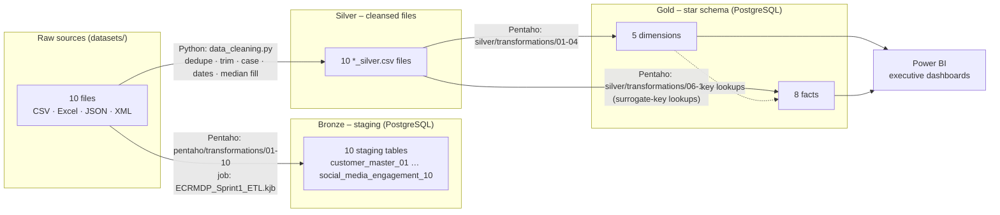
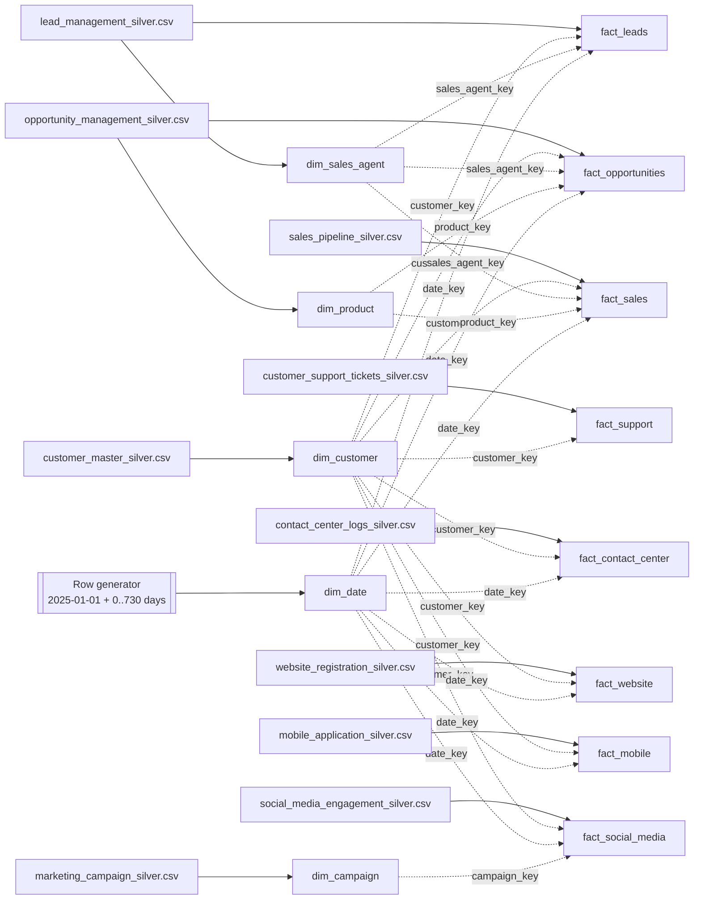
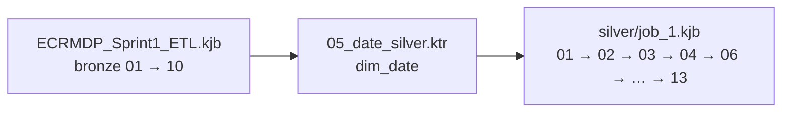

# ECRMDP Data Lineage

**Project:** UC16 – Enterprise CRM Data Platform (Customer 360 & Sales Analytics)
**Sprint:** 3 – Data Governance, Lineage & Analytics
**Baseline:** repository commit `ed6dd39` + Sprint 3 pipeline fixes
**Companion document:** [`metadata/ECRMDP_Source_to_Target_Mapping.xlsx`](../metadata/ECRMDP_Source_to_Target_Mapping.xlsx) (column-level detail)

Everything below was traced from the Pentaho `.ktr`/`.kjb` files, the SQL scripts and `silver/cleansing/data_cleaning.py` in this repository.

---

## 1. End-to-end flow (medallion architecture)



| Layer | Storage | Built by | Tables / files |
|---|---|---|---|
| Raw | `datasets/01_…` – `10_…` | Source systems | 10 files |
| Bronze | PostgreSQL `ecrmdp_dw` | `pentaho/jobs/ECRMDP_Sprint1_ETL.kjb` | 10 staging tables |
| Silver | `datasets/*_silver.csv` | `silver/cleansing/data_cleaning.py` | 10 files |
| Gold | PostgreSQL `ecrmdp_dw` | `silver/transformations/05_date_silver.ktr` + `silver/job_1.kjb` | 5 dimensions, 8 facts |

> **Note:** Bronze and Silver are parallel branches. The cleansing script reads the raw files, not the staging tables, so the star schema is built from the silver CSVs.

---

## 2. Source-level lineage

| # | Source system | Raw file (format) | Bronze table | Silver file | Gold target(s) |
|---|---|---|---|---|---|
| 1 | Customer Master | `01_customer_master.csv` (CSV) | `customer_master_01` | `customer_master_silver.csv` | `dim_customer` |
| 2 | Lead Management | `02_lead_management.xlsx` (Excel) | `lead_management_02` | `lead_management_silver.csv` | `dim_sales_agent`, `fact_leads` |
| 3 | Opportunity Management | `03_opportunity_management.json` (JSON) | `opportunity_management_03` | `opportunity_management_silver.csv` | `dim_product`, `fact_opportunities` |
| 4 | Sales Pipeline | `04_sales_pipeline.xml` (XML) | `sales_pipeline_04` | `sales_pipeline_silver.csv` | `fact_sales` |
| 5 | Marketing Campaigns | `05_marketing_campaign.csv` (CSV) | `marketing_campaign_05` | `marketing_campaign_silver.csv` | `dim_campaign` |
| 6 | Customer Support | `06_customer_support_tickets.csv` (CSV) | `customer_support_tickets_06` | `customer_support_tickets_silver.csv` | `fact_support` |
| 7 | Contact Center | `07_contact_center_logs.csv` (CSV) | `contact_center_logs_07` | `contact_center_logs_silver.csv` | `fact_contact_center` |
| 8 | Website | `08_website_registration.csv` (CSV) | `website_registration_08` | `website_registration_silver.csv` | `fact_website` |
| 9 | Mobile App | `09_mobile_application.csv` (CSV) | `mobile_application_09` | `mobile_application_silver.csv` | `fact_mobile` |
| 10 | Social Media | `10_social_media_engagement.csv` (CSV) | `social_media_engagement_10` | `social_media_engagement_silver.csv` | `fact_social_media` |
| – | (generated) | – | – | – | `dim_date` |

---

## 3. Gold layer lineage (dimensions → facts)



### Surrogate-key lookups

Each fact row gets its dimension keys from a Pentaho **Database lookup** step on a business key:

| Key | Looked up from | Business key used | Used by |
|---|---|---|---|
| `customer_key` | `dim_customer` | `customer_id` | all 8 facts |
| `sales_agent_key` | `dim_sales_agent` | `sales_agent` | `fact_leads`, `fact_opportunities`, `fact_sales` |
| `product_key` | `dim_product` | `product` → `product_name` | `fact_opportunities`, `fact_sales` |
| `campaign_key` | `dim_campaign` | `campaign_id` | `fact_social_media` |
| `date_key` | `dim_date` | `full_date` matched to `lead_date`, `created_date`, `engage_date`, `post_date`, `interaction_datetime`, `registration_datetime`, `event_datetime` | 7 facts (not `fact_support`: its source has no date) |

`date_key` is a smart key: `year × 10000 + month × 100 + day` (for example, 2025-01-01 → `20250101`).

---

## 4. Transformation lineage (what happens to the data)

### Raw → Bronze (`pentaho/transformations/01-10`)
- Input step per format: **CSV file input**, **Microsoft Excel input** (`Sheet1`), **JSON input** (path `$..[*].<field>`), **Get data from XML** (loop `/sales_pipeline/record`).
- **Select values**: type conversion only. Lead, opportunity and sales-pipeline dates are converted with the format `yyyy-MM-dd`. No columns are renamed or dropped.
- **Table output**: connection `DA-1_Project` writes to the staging table.

### Raw → Silver (`silver/cleansing/data_cleaning.py`)
1. Remove fully duplicate rows, then duplicate business IDs, for all 10 sources.
2. Standardise text: trim + lowercase emails; trim + Title Case gender, country, city, lead source/status, opportunity stage and deal stage; trim product names.
3. Parse dates (invalid → null): registration, lead, created, engage and close dates.
4. Fill missing values with the median: customer income and age, lead score, opportunity probability.

### Silver → Gold (`silver/transformations/01-13`)
- **Dimensions** (01-04): direct copy, plus a rename (`product` → `product_name`). `dim_campaign` also keeps `conversion_rate`, `acquisition_cost` and `roi` for campaign-effectiveness analysis. `dim_product` and `dim_sales_agent` are de-duplicated with **Unique rows (HashSet)**.
- **dim_date** (05): **Generate rows** (731) → **Add sequence** → **Calculator** (date parts) → **JavaScript** (`date_key`).
- **Facts** (06-13): **Database lookup** steps add surrogate keys; **Select values 2** removes the business keys that were replaced by surrogate keys.

### Fields deliberately not carried into the warehouse
| Source | Field(s) dropped | Where |
|---|---|---|
| Support tickets | `customer_name`, `customer_email`, `ticket_subject`, `resolution`, `ticket_channel` | `09_support_silver.ktr` |

---

## 5. Orchestration lineage



`dim_date` (05) is **not** part of `silver/job_1.kjb` and has to be run on its own before the facts. A single master job that runs all three in order is a Sprint 3 deliverable.

---

## 6. Known lineage gaps

These are tracked with their status in the **Open_Issues** sheet of the mapping workbook.

| # | Gap | Status |
|---|---|---|
| 1 | `fact_support.date_key` – the support source has no date column | Accepted limitation |
| 2 | `fact_contact_center`, `fact_website`, `fact_mobile` `date_key` – date-time looked up against a date | Verified: 2,000/2,000 correct day in each |
| 3 | `fact_social_media.campaign_key` – was dropped by *Select values 2* | Fixed (Sprint 3) |
| 4 | `fact_sales.opportunity_id` – was removed, breaking deal → opportunity tracing | Fixed (Sprint 3) |
| 5 | Campaign cost/ROI fields were not stored in the warehouse | Fixed (Sprint 3) |
| 6 | `dim_product` / `dim_sales_agent` duplicates | Fixed (`ed6dd39`) |
| 7 | `fact_support` missing `date_key` column | Fixed (`025af5e`) |
| 8 | Bronze steps had no database connection | Fixed (`025af5e`) |
| 9 | `data_cleaning.py` reads raw files from a path outside the repo | Note |

### Accuracy check for gap 2

The date-time facts are looked up against a date-only dimension. This query compares each fact's `date_key` with the calendar day of the original timestamp in the staging layer. When run on 9 October 2026, `correct_day` equalled `rows_checked` (2,000) for all three facts. Re-run it after any change to the date lookups.

```sql
SELECT 'fact_contact_center' AS fact, COUNT(*) AS rows_checked,
       SUM(CASE WHEN f.date_key = TO_CHAR(s.interaction_datetime::date, 'YYYYMMDD')::int THEN 1 ELSE 0 END) AS correct_day
FROM fact_contact_center f JOIN contact_center_logs_07 s USING (interaction_id)
UNION ALL
SELECT 'fact_website', COUNT(*),
       SUM(CASE WHEN f.date_key = TO_CHAR(s.registration_datetime::date, 'YYYYMMDD')::int THEN 1 ELSE 0 END)
FROM fact_website f JOIN website_registration_08 s USING (registration_id)
UNION ALL
SELECT 'fact_mobile', COUNT(*),
       SUM(CASE WHEN f.date_key = TO_CHAR(s.event_datetime::date, 'YYYYMMDD')::int THEN 1 ELSE 0 END)
FROM fact_mobile f JOIN mobile_application_09 s USING (app_event_id);
```
